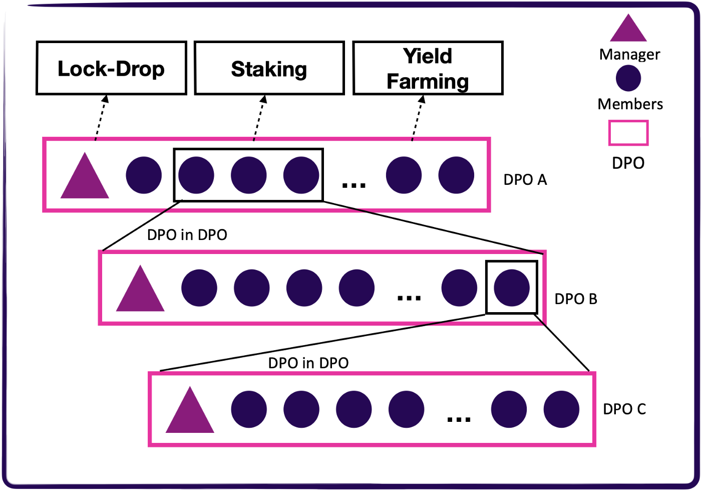

Check [this](https://spannerprotocol.medium.com/introducing-dpo-e4ca0730e1c) Medium post out for its design rational and principles. Users can also use it as is and configure DPO for their usages. 

Notable features of DPO include:
- Binding Governance — Opening participation and governance inclusive to all participants through advanced cryptography. All parameters can be configured and changed through a **binding** DPO governance.
- Transparent incentive — A reward mechanism based strictly on on-chain metrics to drive desired behaviors
- Modularization — Composable and scalable DPO in numerous levels. Enabling DPO in DPO patterns just like the holding structure of LLC.
- Liquidity — A market for all DPO stakes through on-chain swapping with ease compared to how company shares are circulated.

## DPO Structure
DPO is a formalized on-chain organization. A DPO is primarily for crowdfunding. Here's some important basic concepts:
- A DPO is initiated by a **DPO Manager** with a target crowdfund value and bounds (e.g. aims to crowdfund 10k BOLTs and commit to target, either a Growth Box or seats of another DPO, with at least 7% APY)
- A DPO has 100 **seats**, taken by its **DPO Members**. Each seat has the same price, one share of voting power and an equal claim to the rewards of this DPO. 
- **DPO Members** can be either an individual wallet address or a DPO (DPO in DPO). 
    - An individual wallet participant can take up to 20 seats
    - A DPO participant can take up to 30 seats

**Member Referrals**
- Anyone can refer the seat to others. 
    - **Internal Referral**: referred by a DPO member of the same DPO.
    - **External Referral**: otherwise than the above.
- Both Internal and External Referral will share a part of the overall Instant Drop from a [Growth Box](growthbox_rule.md).
- External Referral has only 30% bonus as that of an Internal Referral.
## DPO Incentive
DPO incentive is guaranteed by the Blockchain consensus and based strictly on on-chain metric.
- Dpo Manager is entitled to charge management fee from the rewards of its DPO Members.

For our first launch,
- Management fee 
    - is firstly set as DPO initialization is (5 + Z) %, where Z is the number of seats claimed by the DPO Manager. 
    - is capped at 20%.Claiming more seats later wont increase the fee. The DPO Manager can choose lower the fee by himself. 
    - is subject to slashing conditions. See the DPO Governance section. 

## DPO Governance
DPO governance aims to enforce the DPO operates as intended. It includes:
- Conditions for the DPO state transition.
- Member fund safety. 
- Slashing conditions

For our first launch,

#### DPO State Transition
- Upon initiated, the DPO state becomes **PREPARING**. 
- All seats are required to be taken for the DPO to be **ACTIVE**. 
- The DPO Manager has a 3-day grace period after **ACTIVE** to commit to a eligible target within the target bound. DPO will be tagged as **COMMITTED** after commting to targets.
- After the all the rewards from the target are distributed, the DPO state becomes **COMPLETED**
- If a DPO fails to commit to any target after 14 days since ACTIVE, any of its DPO Member has the **OPTION** to tag the DPO as **DISBANDED**. 

TODO: a flowchart

#### DPO Fund Safety
- If the committed target does not use the DPO funds to its fullest, the rest of the fund will be returned to their origind.
- If the DPO is tagged as **DISBANDED**, all the funds will be returned to their origins.

#### Slashing Condition
DPO Managers are expected to perform some functions for the benefit of the DPO and all of these functions incur costs for consuming Blockchain resources. That justifies the idea of management fee. DPO Managers are given a grace period for different functions. After the grace period, others may have the right to perform the function and the DPO Manager would be slashed accordingly.
- After the 3-day grace period, any other DPO Member can commit to a legitimate target on the behalf of the DPO Manager, in which case the management fee would be slashed by half. 
- Anyone can distribute the DPO rewards to its mebmer by calling the function. A DPO Manager should distribute rewards within 7 days since the last reward distribution checkpoint for better member experiences. Should the DPO Manager fail to do so, half of the management fee for the accumulated rewards will be slashed. If the distribution function was called by its DPO member after the 7-day grace period, the slashed will go to the caller as incentive. 